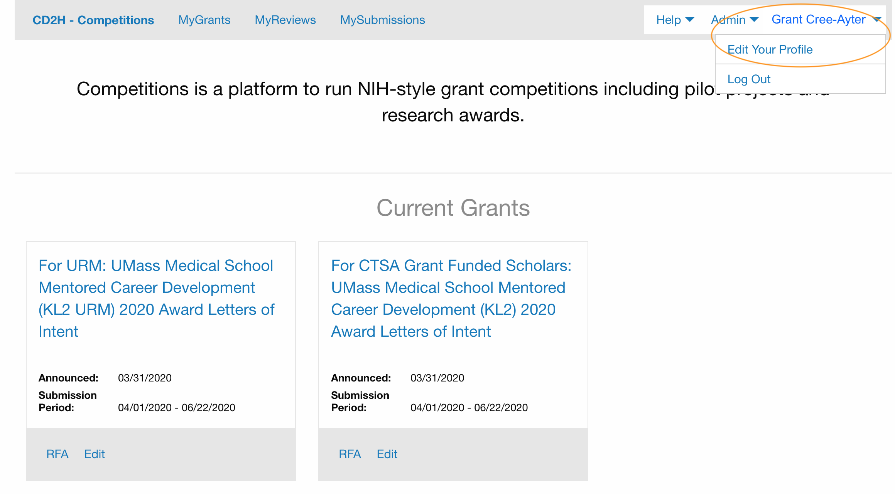
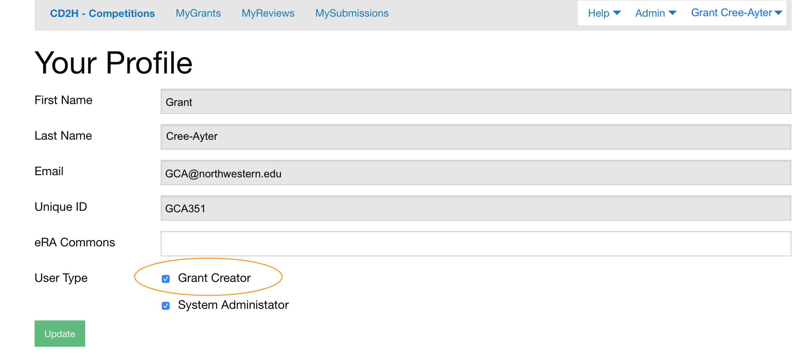
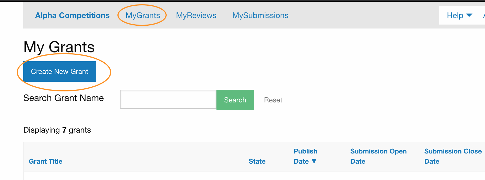
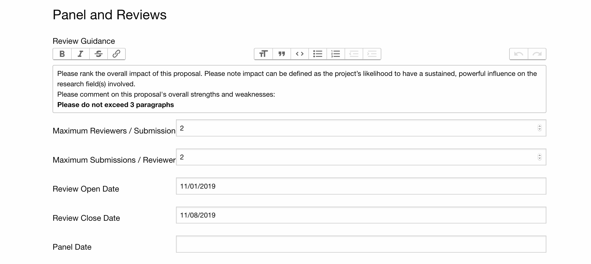
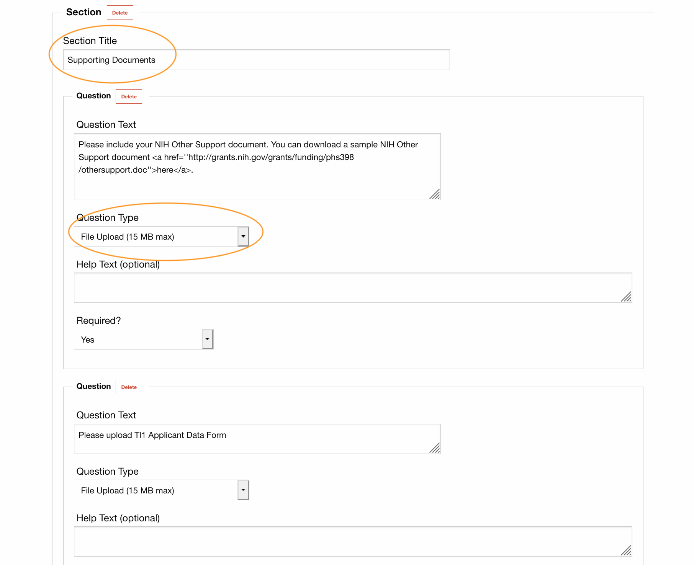
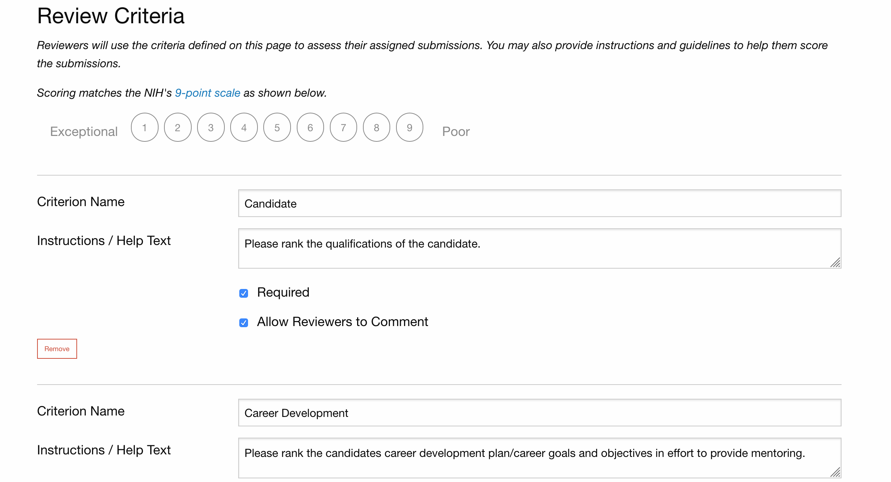
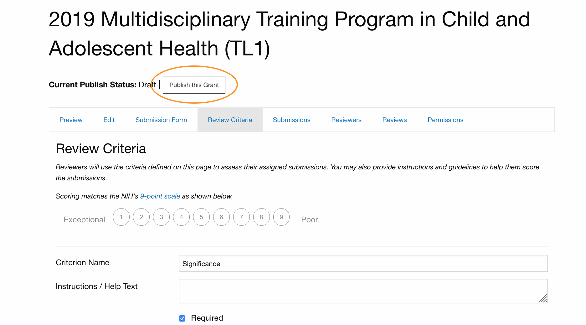

# Creating a Grant in Competitions

To create a grant in Competitions, first apply for Grant Creator access, under Edit Your Profile

You'll receive an email when you've been given access.
When you've gotten that, go back to Competitions, log in and click on MyGrants > Create Grant

Now you can begin creating your grant!

There are three steps to creating your grant.
_Step 1:_ Set up the metadata, or Overview, about your grant. You'll give it a name, provide the Request for Applications (RFA) information, and decide when it should appear on the Competitions website by filling out publish and open/close dates. Note: You have to publish your grant AND the Publish Date needs to have been reached in order for your grant to show up on Competitions. But don't publish yet!

Continue creating the metadata about your grant by filling out how many reviewers should assess a submission. Also provide the limit
of submissions a reviewer has to assess (to avoid reviewer fatigue). Save the Overview sections.

_Step 2_ Set up the questions you'll ask the people applying for your grant. You can provide instructions, group the questions into sections, and specify if they need to upload any documents. Save these Submission Questions when you are done. 

_Step 3_ Set up the criteria by which reviewers should assess submissions. Reviewers need to score the submissions, so what should they be looking for? You can use the given criteria, or remove those and create your own. Provide any considerations reviewers should keep in mind. 

Save your Reviewer Criteria. If you're satisfied with everything, you can Publish this Grant. Remember that you have to publish AND the Publish Date needs to have been reached in order for your grant to show up on Competitions. 

