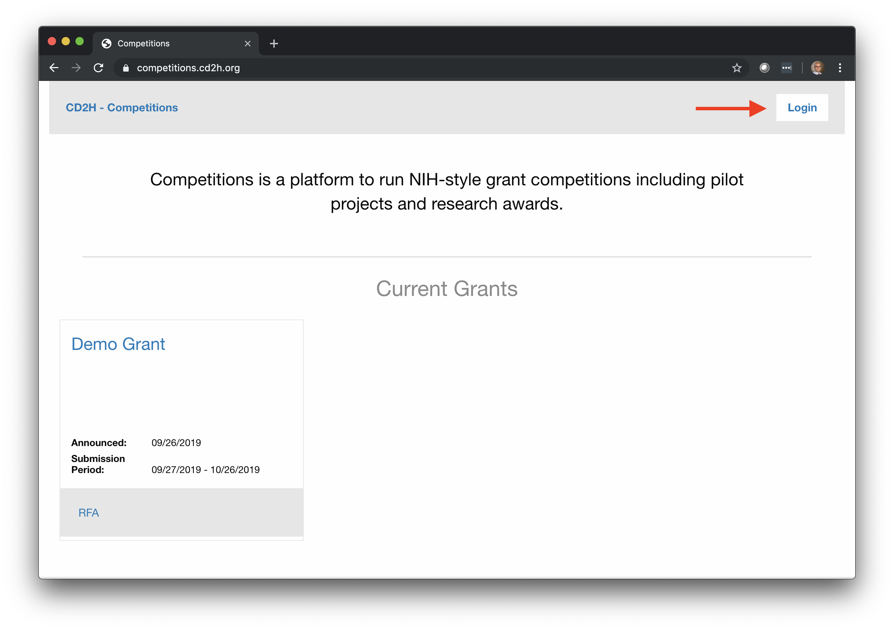
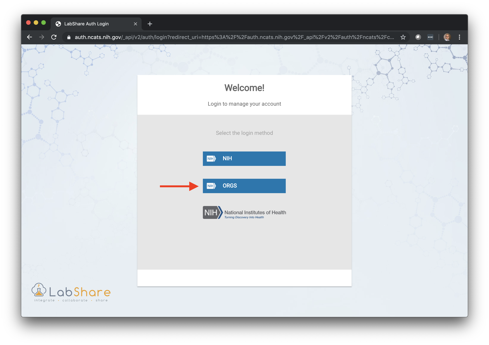
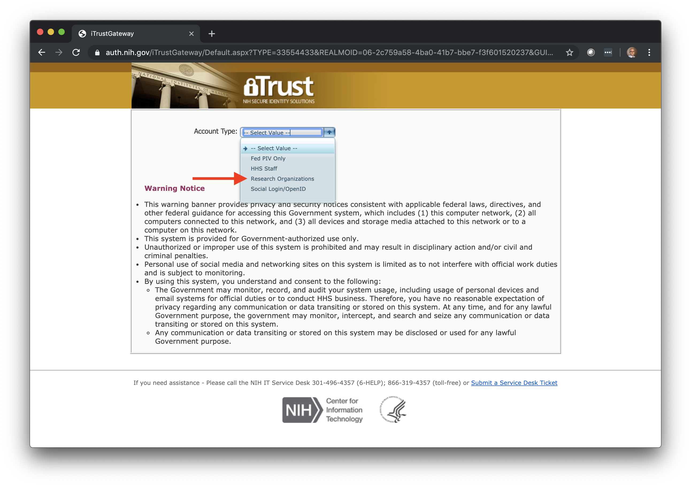
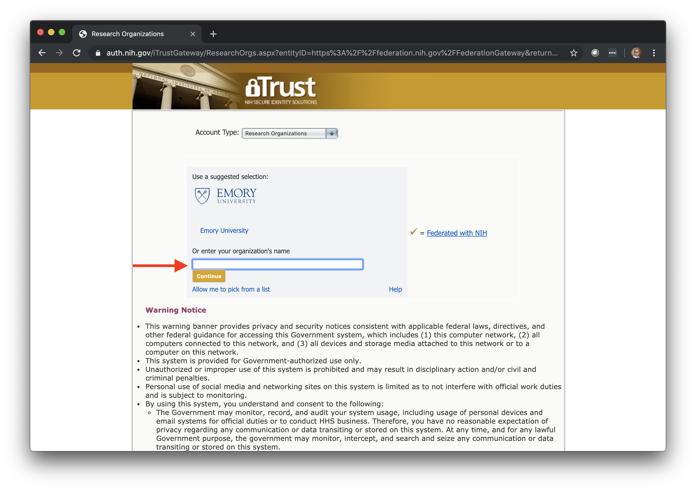
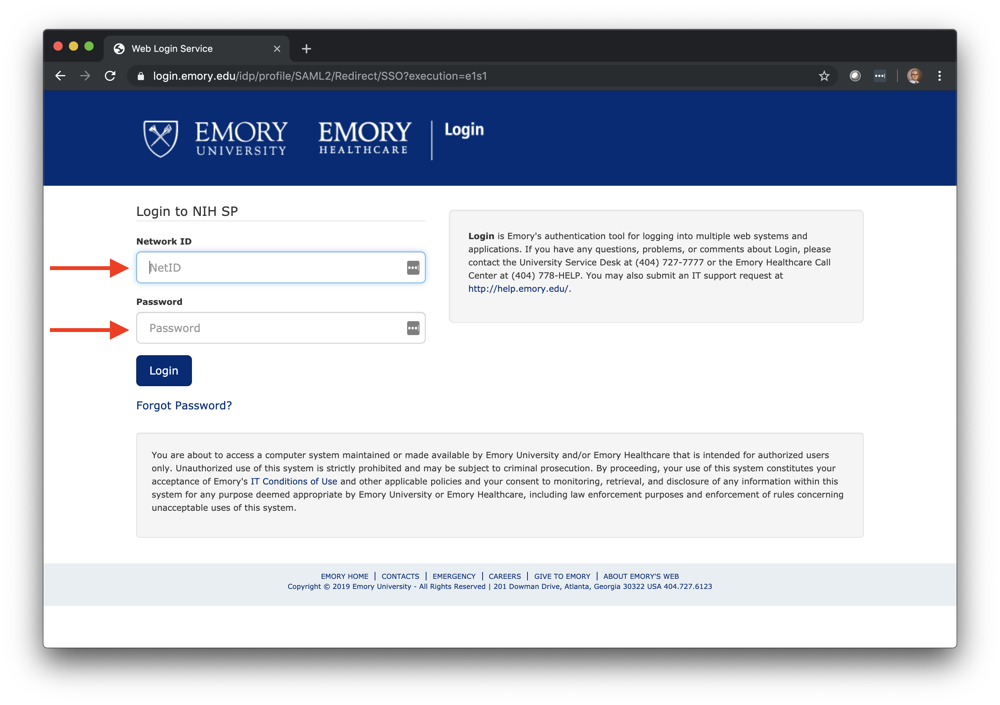

# Logging-in to Competitions

Competitions is designed to rely on federated multi-institutional Single Sign-On (SSO). To do so, you will need to find your organization. The steps below illustrate how to do that if you have an account with a research organization outside of NIH, e.g. Emory University.

